&nbsp;

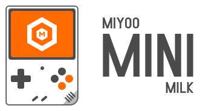

#

**Add a cozy and nostalgic touch to your Miyoo Mini retro handheld system with the Miyoo Mini Milk theme. Featuring warm white and soft orange colors, and cute illustrations, this theme is perfect for fans of retro gaming who want to enjoy a blast from the past.**

    
    &nbsp;&nbsp;&nbsp;&nbsp;&nbsp;
    &nbsp;&nbsp;&nbsp;&nbsp;&nbsp;
    

## LIVE PREVIEW

    
    

## SCREENSHOTS

    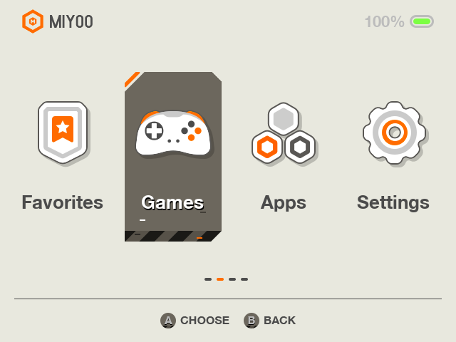
    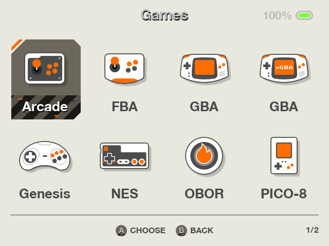
    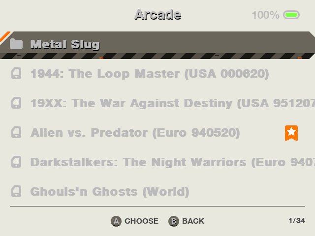
    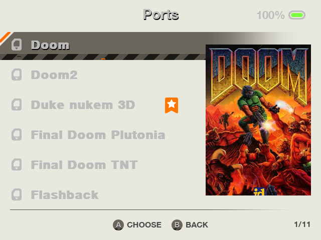
    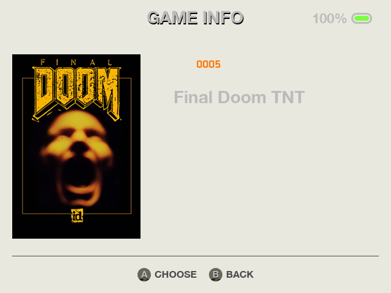
    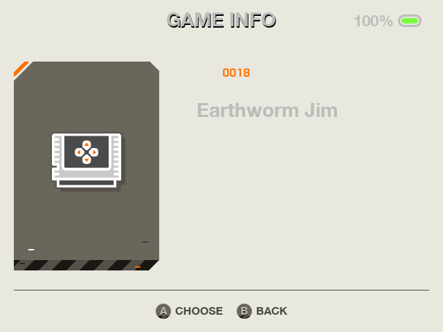
    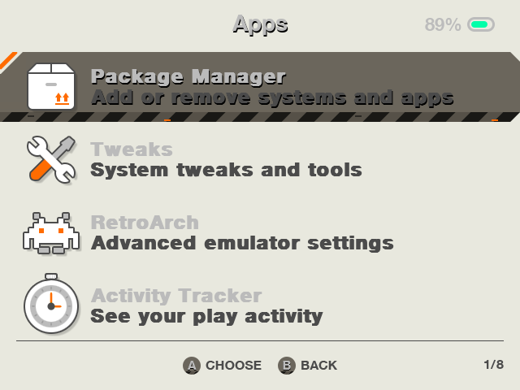
    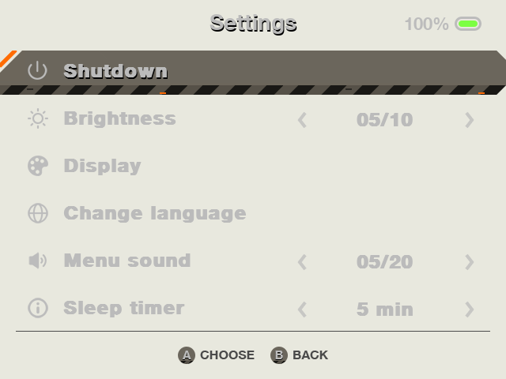
    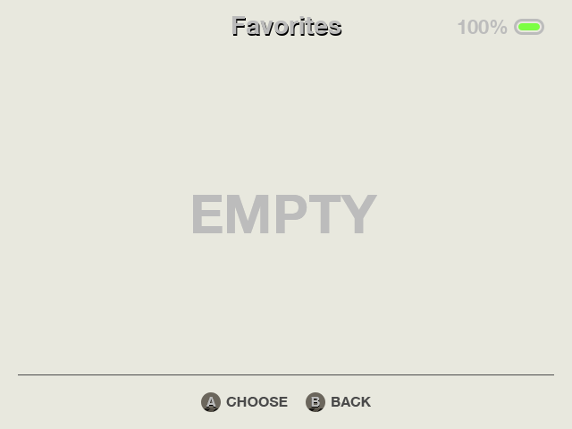
    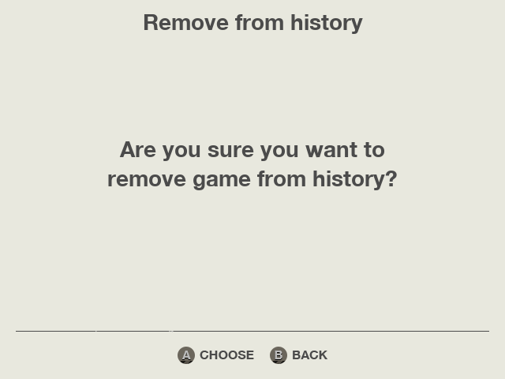
    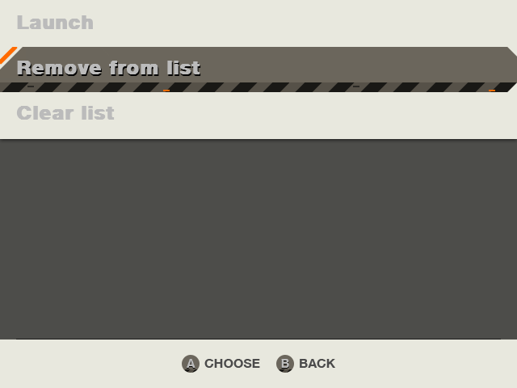
    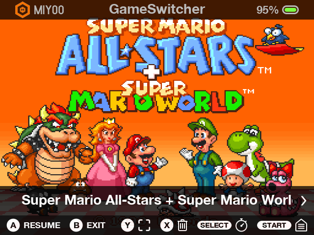

## THEME ICONS

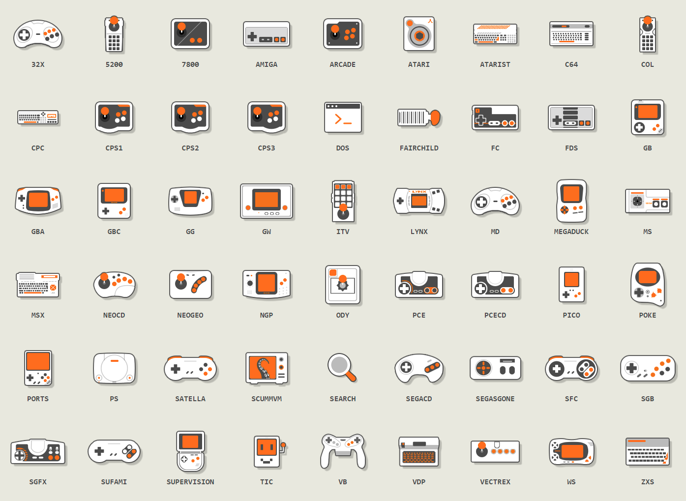

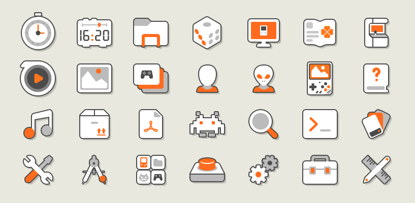

## SAY THANKS 

**If you're feeling generous and want to support my work, I'd be super grateful! You can check out my &nbsp; <a href="https://ko-fi.com/segich" target="_blank"> Ko-fi</a> &nbsp; page if you want to contribute a little something. It'll help me keep creating awesome themes for retro gaming fans like you.**

#

<i>Icons by <a href="https://ko-fi.com/segich" target="_blank">Segich</a>, <a href="https://icons8.com" target="_blank">Icons8</a>, <a href="https://github.com/OnionUI/Onion" target="_blank">Onion</a>, Dreambrace, Miyoo</i>

